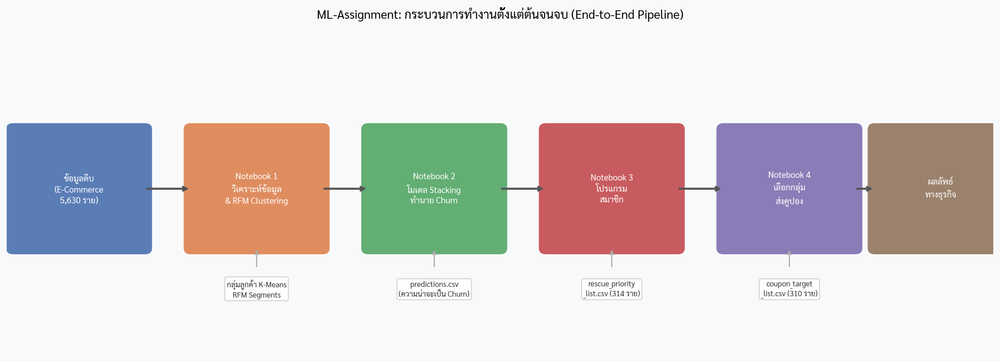

# ML-Assignment: ระบบทำนายการลาออกของลูกค้าและกลยุทธ์การรักษา

## ปัญหาทางธุรกิจ

บริษัท E-Commerce กำลังเผชิญกับปัญหาลูกค้าหยุดใช้บริการ (Churn) ในอัตรา **16.84% (948 จาก 5,630 ราย)** ต้นทุนในการหาลูกค้าใหม่สูงกว่าการรักษาลูกค้าเดิมหลายเท่า เป้าหมายคือระบุลูกค้าที่เสี่ยงจะลาออกก่อน แล้วใช้กลยุทธ์การรักษาที่ตรงเป้าหมายเพื่อเพิ่ม ROI และลดการส่งคูปองที่ไม่จำเป็น

## กระบวนการทำงานตั้งแต่ต้นจนจบ



โปรเจกต์นี้แบ่งออกเป็น **4 Notebook** ที่ทำงานต่อเนื่องกัน:

| Notebook | ชื่อ | หน้าที่ |
|---|---|---|
| 1 | `1_eda_churn.ipynb` | วิเคราะห์ข้อมูล (EDA) + RFM Clustering |
| 2 | `2_prediction_stacking.ipynb` | สร้างโมเดล Stacking ทำนาย Churn → `predictions.csv` |
| 3 | `3_prediction_loyalty.ipynb` | แบ่งกลุ่ม Value-Risk → `rescue_priority_list.csv` |
| 4 | `4_prediction_coupon.ipynb` | เลือกกลุ่มส่งคูปองด้วย ROI Score → `coupon_target_list.csv` |

**ลำดับการรัน**: Notebook 1 → 2 → 3 (และ/หรือ 4, ทำงานอิสระจากกัน)

## ผลลัพธ์หลัก

| ตัวชี้วัด | ค่า |
|---|---|
| ROC-AUC (Stacking Ensemble) | **0.9974** |
| Accuracy | **98.05%** |
| F1 Score | **0.9433** |
| Precision (Churn) | **92%** |
| Recall (Churn) | **96%** |
| กลุ่ม RESCUE ที่ระบุได้ | **314 ราย (5.6%)** |
| ผู้รับคูปองสุดท้าย | **310 ราย (5.5%)** |
| ลดคูปองที่สูญเปล่า | **94.5%** |
| Precision ของคูปอง | **100%** |

### ผลกระทบต่อธุรกิจ

| สถานการณ์ | คูปองที่ส่ง | สูญเปล่า |
|---|---|---|
| ไม่ใช้ ML (แจกทุกคน) | 5,630 ฉบับ | 4,682 ฉบับ (83.2%) |
| ใช้ ML Targeting | 310 ฉบับ | 0 ฉบับ (0%) |
| **ประหยัดได้** | **−5,320 ฉบับ** | **−94.5%** |

## เทคโนโลยีที่ใช้

| Library | บทบาท |
|---|---|
| numpy, pandas | การคำนวณและจัดการข้อมูล |
| scikit-learn | ML pipeline, CrossValidation, Metrics, Preprocessing |
| xgboost | Base model (XGBoost Classifier) |
| lightgbm | Base model (LightGBM Classifier) |
| matplotlib, seaborn | การสร้างกราฟและ Visualization |

## โครงสร้างโปรเจกต์

```
ML-Assignment/
├── data/
│   └── Ecommerce Customer Churn.csv    # ข้อมูลดิบ
├── outputs/
│   ├── csv/
│   │   ├── predictions.csv             # ความน่าจะเป็น Churn (5,630 ราย)
│   │   ├── rescue_priority_list.csv    # กลุ่ม RESCUE (314 ราย)
│   │   └── coupon_target_list.csv      # ผู้รับคูปอง (310 ราย)
│   └── figures/                        # ภาพกราฟทั้งหมด
├── 1_eda_churn.ipynb
├── 2_prediction_stacking.ipynb
├── 3_prediction_loyalty.ipynb
├── 4_prediction_coupon.ipynb
└── notebook-lm-source/                 # เอกสารชุดนี้
```
