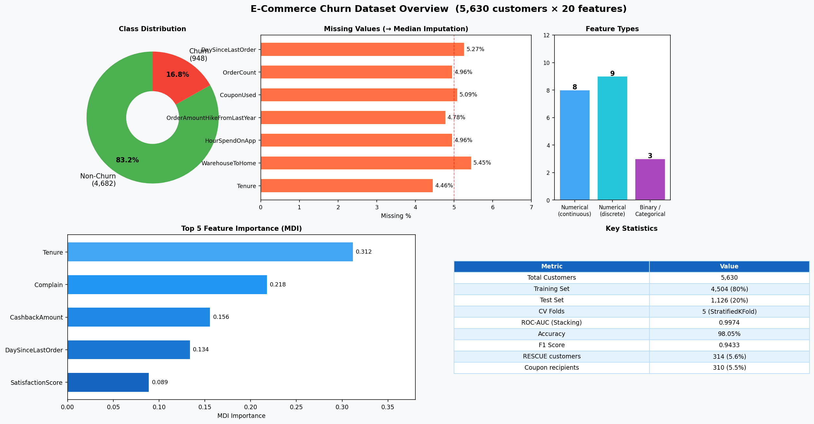

# Dataset Guide: E-Commerce Customer Churn

## Dataset Overview



- **Total customers**: 5,630
- **Features**: 20 (after encoding)
- **Target variable**: `Churn` (0 = Non-Churn, 1 = Churn)
- **Class distribution**: 83.16% Non-Churn (4,682) / 16.84% Churn (948)

## Feature Reference Table

| # | Column | Type | Description | Missing % |
|---|---|---|---|---|
| 1 | CustomerID | ID | Unique customer identifier | 0% |
| 2 | Churn | Binary Target | 1 = churned, 0 = retained | 0% |
| 3 | Tenure | Numerical | Months as customer | **4.46%** |
| 4 | PreferredLoginDevice | Categorical | Mobile Phone / Computer / Tablet | 0% |
| 5 | CityTier | Ordinal | City tier 1/2/3 | 0% |
| 6 | WarehouseToHome | Numerical | Distance (km) to warehouse | **5.45%** |
| 7 | PreferredPaymentMode | Categorical | Credit Card / Debit Card / UPI / COD / E-wallet | 0% |
| 8 | Gender | Binary | Male / Female | 0% |
| 9 | HourSpendOnApp | Numerical | Hours per month on app | **4.96%** |
| 10 | NumberOfDeviceRegistered | Discrete | Devices registered (1–6) | 0% |
| 11 | PreferedOrderCat | Categorical | Preferred product category | 0% |
| 12 | SatisfactionScore | Ordinal | Customer satisfaction 1–5 | 0% |
| 13 | MaritalStatus | Categorical | Single / Married / Divorced | 0% |
| 14 | NumberOfAddress | Discrete | Saved delivery addresses | 0% |
| 15 | Complain | Binary | 1 = filed complaint last month | 0% |
| 16 | OrderAmountHikeFromLastYear | Numerical | % increase in order amount YoY | **4.78%** |
| 17 | CouponUsed | Discrete | Coupons used last month | **5.09%** |
| 18 | OrderCount | Discrete | Orders placed last month | **4.96%** |
| 19 | DaySinceLastOrder | Numerical | Days since last order | **5.27%** |
| 20 | CashbackAmount | Numerical | Average cashback (Baht/month) | 0% |

## Missing Values Strategy

7 columns have missing data ranging from **4.46% to 5.45%**:

```
Tenure                         4.46%  →  Median Imputation
WarehouseToHome                5.45%  →  Median Imputation
HourSpendOnApp                 4.96%  →  Median Imputation
OrderAmountHikeFromLastYear    4.78%  →  Median Imputation
CouponUsed                     5.09%  →  Median Imputation
OrderCount                     4.96%  →  Median Imputation
DaySinceLastOrder              5.27%  →  Median Imputation
```

**Rationale**: Median imputation was chosen over mean because numerical features may be skewed (e.g., DaySinceLastOrder, WarehouseToHome). Median is robust to outliers and preserves the central tendency without introducing bias.

## Class Imbalance

| Class | Count | Percentage |
|---|---|---|
| Non-Churn (0) | 4,682 | 83.16% |
| Churn (1) | 948 | 16.84% |

The ~5:1 imbalance is handled by:
- Using `StratifiedKFold` (CV=5) to maintain class proportions across folds
- Evaluating with F1-Score and ROC-AUC instead of raw accuracy
- Analyzing Precision-Recall curve for threshold selection

## Train/Test Split

```python
X_train, X_test, y_train, y_test = train_test_split(
    X, y, test_size=0.2, random_state=42, stratify=y
)
# Result: 4,504 training rows / 1,126 test rows
```

## Output Files Generated

### `predictions.csv` (5,630 rows × 16 columns)
Contains original features + model predictions for all customers:

| Column | Description |
|---|---|
| CustomerID | Original ID |
| Churn | Actual label |
| Churn_Prob | Stacking model's churn probability (0.0–1.0) |
| Churn_Pred | Binary prediction at 0.5 threshold |
| CashbackAmount | Used for Value-Risk segmentation |
| ... | Other original features |

### `rescue_priority_list.csv` (314 rows)
RESCUE segment customers sorted by churn probability:
- High Churn Risk (≥ 35%) AND High Value (CashbackAmount ≥ 163 Baht)
- Sorted descending by `Churn_Prob`
- Avg churn prob: **96.4%**, Avg cashback: **202 Baht**, Avg tenure: **5.58 months**

### `coupon_target_list.csv` (310 rows)
Final coupon recipients after ROI scoring + threshold filtering:
- Subset of RESCUE customers with `Churn_Prob ≥ 0.777`
- Includes `ROI_Score` column (0–100 normalized)
- Precision: **100%** (all are actual churners)

## Key Insights from EDA

1. **Tenure is the strongest churn predictor**: Customers with < 3 months tenure churn at 3× the average rate.
2. **Complaints drive churn**: Customers who filed a complaint have ~40% churn rate vs 14% for non-complainers.
3. **CashbackAmount is bimodal**: Clear separation between low-value (< 163) and high-value (≥ 163) segments.
4. **DaySinceLastOrder**: Churners tend to have longer gaps since last order (more disengaged).
5. **SatisfactionScore paradox**: Some high-satisfaction customers still churn — indicating loyalty fragility.
