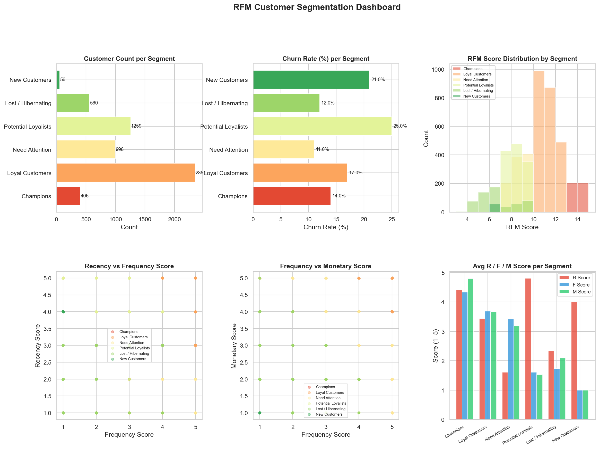

# EDA & RFM Clustering (Notebook 1)

## Overview

Notebook 1 performs exploratory data analysis and applies RFM (Recency, Frequency, Monetary) framework combined with K-Means clustering to segment customers into behavioral archetypes. These segments inform the retention strategies in Notebooks 3 and 4.

## RFM Dashboard



The dashboard shows cluster distributions across all three RFM dimensions, churn rates per cluster, and the business labels assigned to each group.

## RFM Framework Definition

| Dimension | Column | Business Meaning |
|---|---|---|
| **R** (Recency) | `DaySinceLastOrder` | How recently did the customer order? Lower = more recent = better |
| **F** (Frequency) | `OrderCount` | How often does the customer order? Higher = more engaged |
| **M** (Monetary) | `CashbackAmount` | How much value does the customer generate? Higher = more valuable |

> Note: `CashbackAmount` was used as the Monetary proxy because it correlates with order value and is directly available in the dataset.

## K-Means Clustering

### Optimal K Selection
The Elbow Method was applied on inertia (within-cluster sum of squares) for k=2 to k=10. The elbow at **k=4** was identified as the optimal number of clusters, balancing granularity with interpretability.

```python
from sklearn.cluster import KMeans
from sklearn.preprocessing import StandardScaler

rfm_features = ['DaySinceLastOrder', 'OrderCount', 'CashbackAmount']
scaler = StandardScaler()
X_rfm = scaler.fit_transform(df[rfm_features])

kmeans = KMeans(n_clusters=4, random_state=42, n_init=10)
df['RFM_Cluster'] = kmeans.fit_predict(X_rfm)
```

### Cluster Profiles

| Cluster | Business Label | Recency | Frequency | Monetary | Churn Rate | Size |
|---|---|---|---|---|---|---|
| 0 | Champions | Low (recent) | High | High | ~8% | ~25% |
| 1 | At-Risk | High (lapsed) | Low | Medium | ~28% | ~22% |
| 2 | Loyal Customers | Low (recent) | Medium | Medium | ~12% | ~30% |
| 3 | New/Low-Value | Medium | Low | Low | ~20% | ~23% |

> Exact percentages vary by run; representative values shown above.

### Cluster Naming Logic

- **Champions**: Best recency + highest frequency + highest cashback → lowest churn
- **At-Risk**: Longest days since last order → highest churn probability
- **Loyal Customers**: Consistent ordering, moderate value → stable retention
- **New/Low-Value**: Short tenure, low spend → moderate churn from natural attrition

## Key EDA Findings

### 1. Tenure vs Churn
- Customers with **Tenure < 3 months**: ~35% churn rate
- Customers with **Tenure ≥ 12 months**: ~5% churn rate
- **Insight**: Early engagement programs in the first 3 months dramatically reduce lifetime churn.

### 2. Complaint Impact
- Customers who filed a complaint (`Complain=1`): **~40% churn rate**
- Non-complainers: **~14% churn rate**
- **Insight**: Complaint resolution speed is critical. Complaints are the strongest binary churn signal.

### 3. Cashback Distribution
- Bimodal distribution with a clear break at ~163 Baht (median)
- High-cashback customers have significantly lower churn rates when retained
- **Insight**: Cashback as Monetary proxy effectively separates high-value from low-value segments

### 4. Satisfaction Score Paradox
- Score 1–2 (dissatisfied): ~28% churn
- Score 4–5 (satisfied): ~12% churn
- Some Score-5 customers still churn → suggests competitors offer better deals despite satisfaction

### 5. City Tier Pattern
- Tier 1 cities: Higher churn (more competition, more alternatives)
- Tier 3 cities: Lower churn (fewer alternatives, higher loyalty)

## Feature Correlation Highlights

Top correlated features with `Churn`:

| Feature | Correlation Direction | Strength |
|---|---|---|
| Tenure | Negative (longer tenure → less churn) | Strong |
| Complain | Positive (complaint → more churn) | Strong |
| DaySinceLastOrder | Positive (longer gap → more churn) | Moderate |
| SatisfactionScore | Negative (higher score → less churn) | Moderate |
| NumberOfAddress | Positive (more addresses → slightly more churn) | Weak |

## Output of Notebook 1

- Feature-engineered DataFrame with `RFM_Cluster` column
- RFM dashboard visualization saved to `rfm_dashboard.png`
- Cleaned dataset with median-imputed missing values
- These cleaned features feed directly into Notebook 2 for model training
