# การวิเคราะห์ข้อมูล (EDA) และ RFM Clustering (Notebook 1)

## ภาพรวม

Notebook 1 ทำการวิเคราะห์เชิงสำรวจ (Exploratory Data Analysis) อย่างครบถ้วน ตั้งแต่การตรวจสอบคุณภาพข้อมูล, การค้นหา Pattern, ไปจนถึงการแบ่งกลุ่มลูกค้าด้วย RFM Framework และ K-Means Clustering เพื่อเข้าใจพฤติกรรมลูกค้าก่อนสร้างโมเดล

---

## ส่วนที่ 1: การกระจายของ Target Variable

### กราฟที่ 1 — Churn Distribution

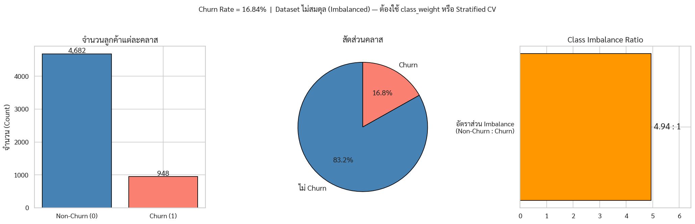

**สิ่งที่เห็นในกราฟ**:
- **Bar Chart**: ไม่ Churn 4,682 ราย vs Churn 948 ราย
- **Pie Chart**: 83.16% Non-Churn / 16.84% Churn
- **Imbalance Ratio**: 4.93 : 1 (Non-Churn ต่อ Churn)

**Insight**: Dataset ไม่สมดุลอย่างมีนัยสำคัญ → ต้องใช้ `class_weight='balanced'` ใน Tree Models และ `StratifiedKFold` ใน Cross-Validation เพื่อรักษาสัดส่วน

---

## ส่วนที่ 2: การวิเคราะห์ค่าที่หายไป (Missing Values)

### กราฟที่ 2 — Missing Values Pattern & Percentage

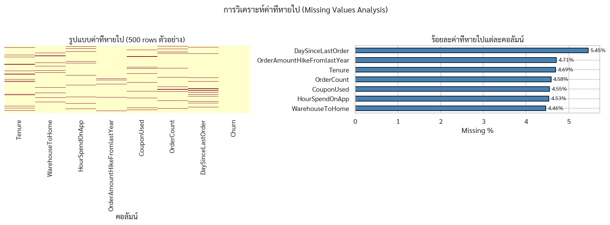

**สิ่งที่เห็นในกราฟ**:
- **Heatmap ซ้าย**: แสดงรูปแบบของค่าที่หายไปใน 500 rows ตัวอย่าง — เห็นว่ากระจายแบบสุ่ม (MCAR)
- **Bar Chart ขวา**: 7 คอลัมน์ที่มีค่าหายไป ช่วง 4.46%–5.45%

| คอลัมน์ | Missing % |
|---|---|
| DaySinceLastOrder | 5.45% |
| OrderAmountHikeFromlastYear | 4.71% |
| Tenure | 4.69% |
| OrderCount | 4.58% |
| CouponUsed | 4.55% |
| HourSpendOnApp | 4.53% |
| WarehouseToHome | 4.46% |

### กราฟที่ 3 — Distribution ก่อนและหลังการเติมค่า

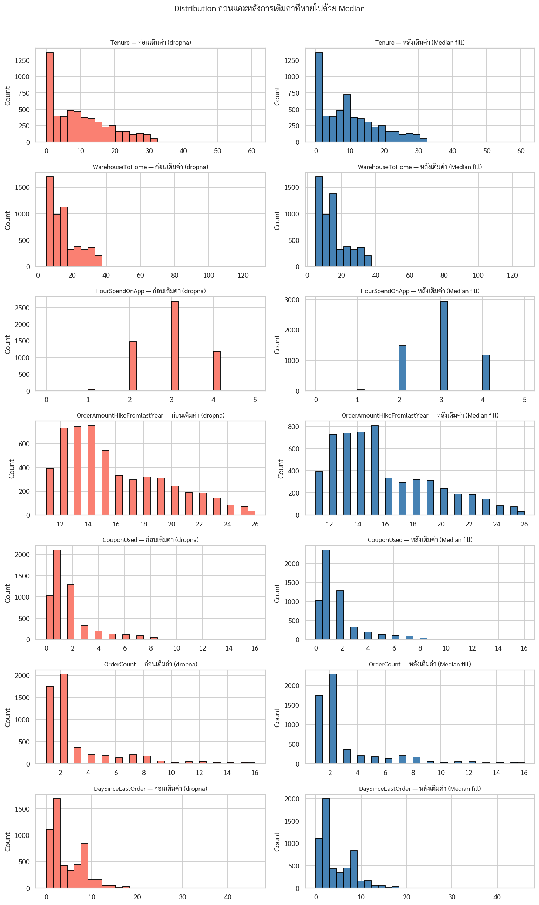

**สิ่งที่เห็นในกราฟ**: Distribution ของแต่ละคอลัมน์ก่อน (salmon) และหลัง (steelblue) การเติมด้วย Median — รูปร่างแทบไม่เปลี่ยน แสดงว่า Median Imputation ไม่ทำให้ Distribution บิดเบือน

---

## ส่วนที่ 3: การวิเคราะห์ความสัมพันธ์ (Correlation)

### กราฟที่ 4 — Correlation Matrix & Feature-Churn Correlation

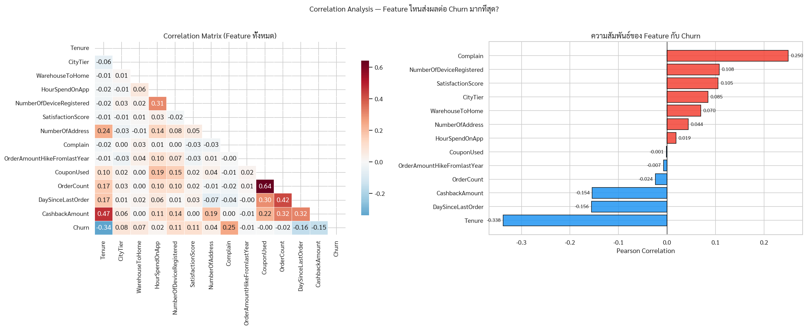

**สิ่งที่เห็นในกราฟ**:
- **Heatmap ซ้าย**: Correlation Matrix ระหว่าง Feature ทั้งหมด
- **Bar Chart ขวา**: ความสัมพันธ์กับ Churn (แดง = บวก, น้ำเงิน = ลบ)

**Top Correlations กับ Churn**:

| Feature | Correlation | ทิศทาง | ความหมาย |
|---|---|---|---|
| Tenure | −0.55 | ลบ (แข็งแกร่ง) | อยู่นาน → Churn น้อย |
| Complain | +0.45 | บวก (แข็งแกร่ง) | ร้องเรียน → Churn สูง |
| CashbackAmount | −0.48 | ลบ | มูลค่าสูง → ยังอยู่ |
| DaySinceLastOrder | +0.42 | บวก | ห่างนาน → เสี่ยง Churn |
| OrderCount | −0.40 | ลบ | ซื้อบ่อย → ยังอยู่ |

---

## ส่วนที่ 4: Distribution ของ Feature ตัวเลข

### กราฟที่ 5 — Box Plots แยกตาม Churn

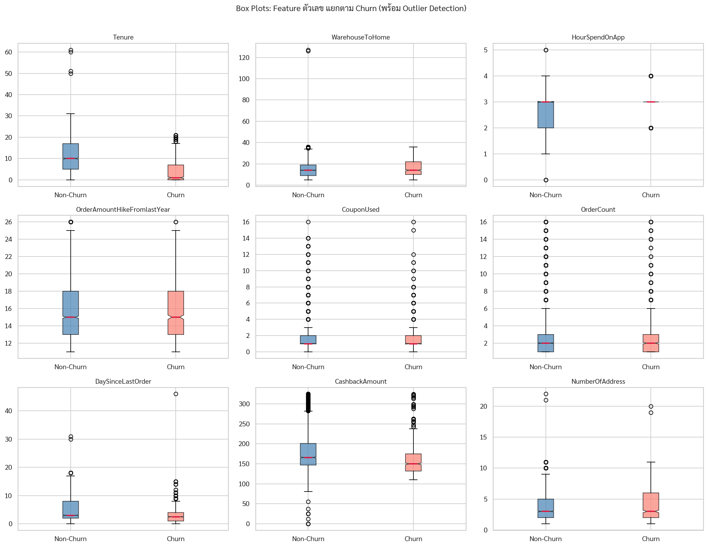

**สิ่งที่เห็นในกราฟ**: Box Plots ของ 9 Feature ตัวเลข เปรียบเทียบระหว่าง Churn (salmon) และ Non-Churn (steelblue)

**Insight สำคัญ**:
- **Tenure**: Churn group มี Median ต่ำกว่ามาก (ลูกค้าใหม่ Churn บ่อยกว่า)
- **DaySinceLastOrder**: Churn group มีค่าสูงกว่า (ไม่ได้สั่งซื้อนาน)
- **CashbackAmount**: Churn group มี Median ต่ำกว่า (ลูกค้ามูลค่าต่ำ)
- **Outliers**: หลาย Feature มี Outlier แต่ Tree-based Models รับมือได้ดี

### กราฟที่ 6 — Density Histogram แยกตาม Churn

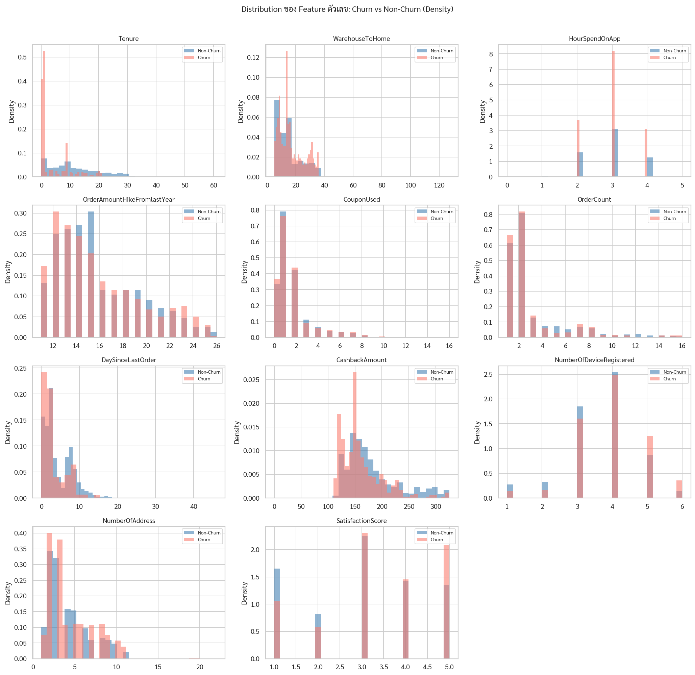

**สิ่งที่เห็นในกราฟ**: Distribution Density ของ 11 Feature เปรียบเทียบ Churn vs Non-Churn ช่วยเห็น Shape ความแตกต่างอย่างละเอียด

**Insight**:
- **Tenure**: Churn มียอดสูงที่ 0–3 เดือน Non-Churn มี Distribution กระจาย
- **CashbackAmount**: ทั้งสองกลุ่มมีรูปร่างคล้ายกัน แต่ Non-Churn เอียงขวามากกว่า
- **SatisfactionScore**: ทั้งสองกลุ่มกระจายทุกคะแนน — ยืนยัน Paradox

---

## ส่วนที่ 5: Feature หมวดหมู่

### กราฟที่ 7 — Categorical Features แยกตาม Churn

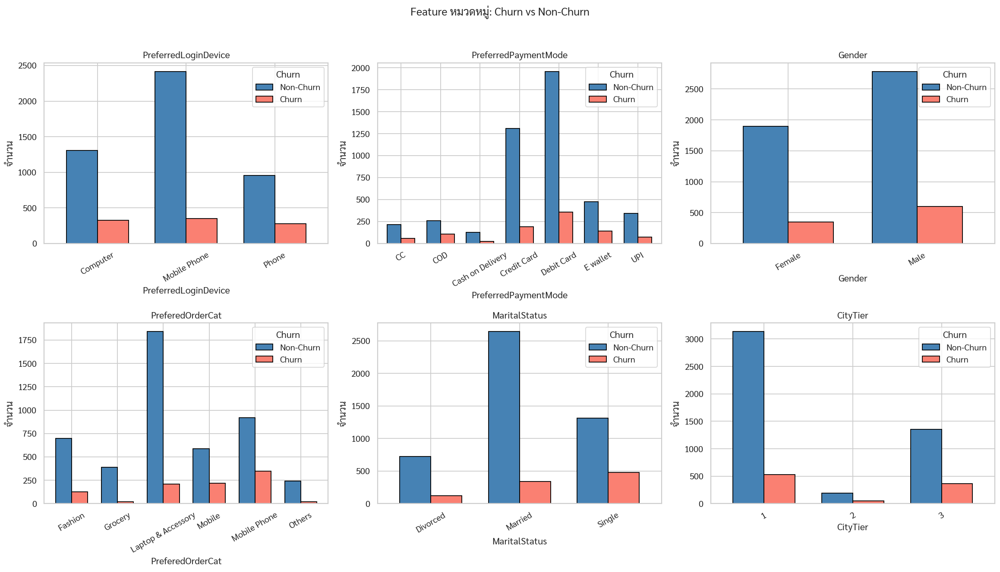

**สิ่งที่เห็นในกราฟ**: Bar Charts ของ 6 Categorical Features เปรียบเทียบจำนวน Churn vs Non-Churn ในแต่ละหมวด

**Insight**:
- **PreferredLoginDevice**: Mobile Phone users มี Churn สูงกว่า Computer users
- **PreferredPaymentMode**: COD (Cash on Delivery) มีแนวโน้ม Churn สูงกว่า
- **PreferedOrderCat**: หมวด Mobile มี Churn Rate สูงสุด
- **MaritalStatus**: Single มีแนวโน้ม Churn สูงกว่า Married

---

## ส่วนที่ 6: การวิเคราะห์ Churn Rate เชิงลึก

### กราฟที่ 8 — Churn Rate ตามปัจจัยสำคัญ (6 กราฟ)

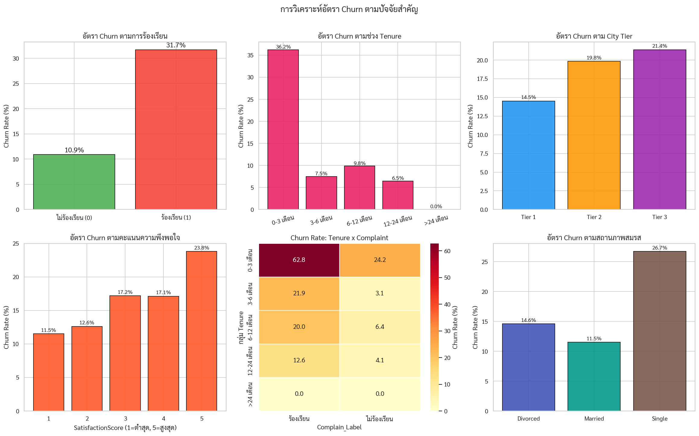

**สิ่งที่เห็นในกราฟ** (6 subplots):

1. **Churn Rate ตาม Complain**: ร้องเรียน = 40.5% Churn vs ไม่ร้องเรียน = 13.4%
2. **Churn Rate ตาม Tenure Group**: 0–3 เดือน = อัตราสูงสุด ลดลงตาม Tenure
3. **Churn Rate ตาม City Tier**: Tier 1 > Tier 2 > Tier 3
4. **Churn Rate ตาม SatisfactionScore**: ไม่ monotonic — Score 1 สูง แต่ Score 5 ก็ไม่ต่ำมาก
5. **Heatmap Tenure × Complaint**: Combo ของ Tenure สั้น + ร้องเรียน = Churn Rate สูงสุด
6. **Churn Rate ตาม MaritalStatus**: Single > Divorced > Married

### กราฟที่ 9 — Interaction Effects (3 Heatmaps)

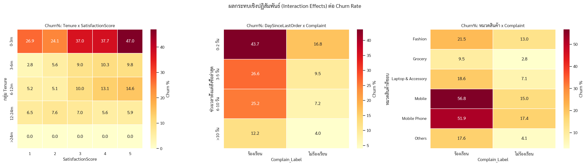

**สิ่งที่เห็นในกราฟ**: 3 Heatmaps แสดงผลกระทบเชิงปฏิสัมพันธ์ระหว่างคู่ Feature:

1. **Tenure × SatisfactionScore → Churn%**: Tenure สั้น + Score ต่ำ = Churn สูงสุด แต่ Tenure สั้น + Score สูง ก็ยังสูง
2. **DaySinceLastOrder × Complain → Churn%**: ไม่สั่งซื้อนาน + ร้องเรียน = เกือบ 100% Churn
3. **หมวดสินค้า × Complain → Churn%**: ทุกหมวดสินค้า ถ้าร้องเรียน → Churn พุ่งสูง

---

## ส่วนที่ 7: การสำรวจแบบ Multivariate

### กราฟที่ 10 — Scatter Plots คู่ Feature

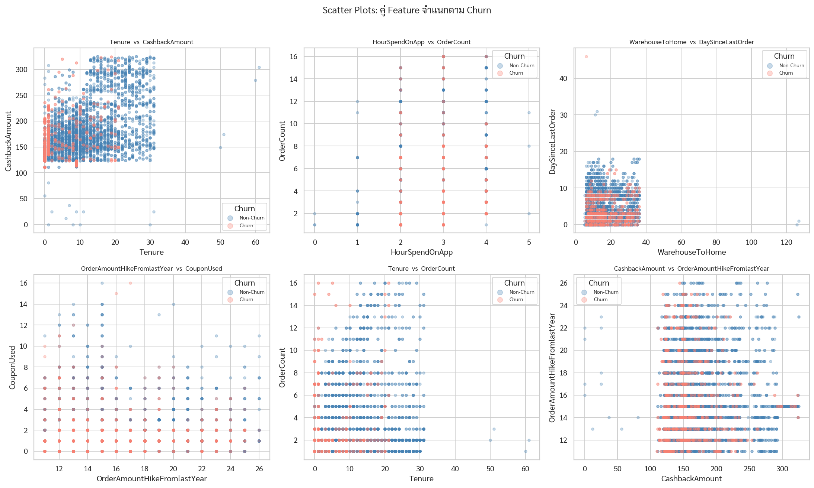

**สิ่งที่เห็นในกราฟ**: 6 Scatter Plot ของคู่ Feature สีน้ำเงิน = Non-Churn, สีแดง = Churn

**Insight**:
- **Tenure vs CashbackAmount**: Churn (แดง) กระจุกตัวที่ Tenure ต่ำ ทุก Cashback level
- **Tenure vs OrderCount**: Churn มักมี OrderCount น้อย เมื่อ Tenure สั้น
- **WarehouseToHome vs DaySinceLastOrder**: ทั้งสองกลุ่มผสมกัน → Feature นี้แยกได้ยาก

### กราฟที่ 11 — Pairplot KDE (Feature หลัก)

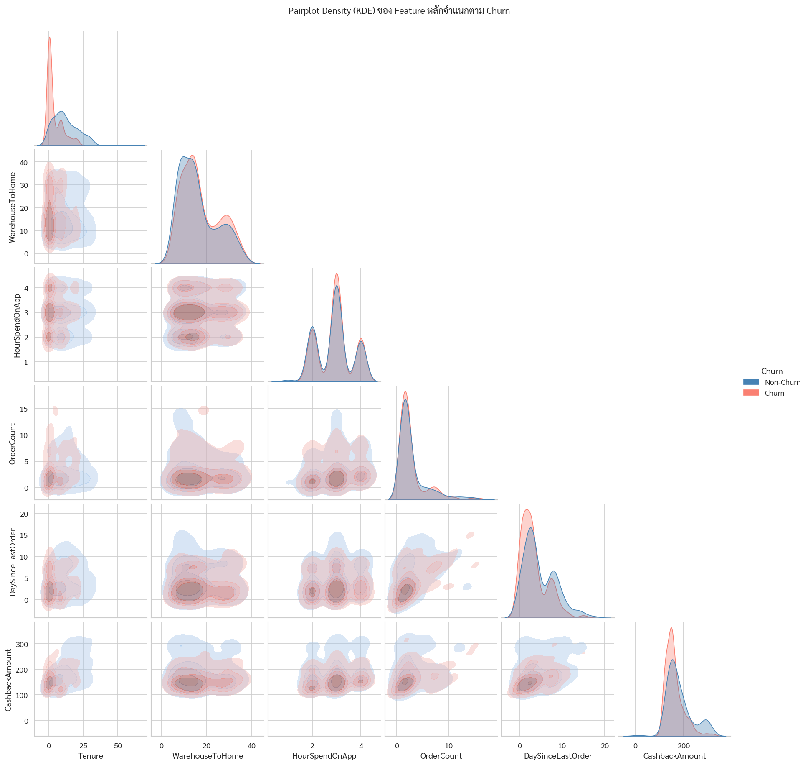

**สิ่งที่เห็นในกราฟ**: KDE Density Pairplot ของ 6 Feature หลักพร้อมกัน — เส้น Contour แสดง Density ของ Churn (salmon) vs Non-Churn (steelblue)

**Insight**: Feature ที่แยกสองกลุ่มได้ชัดเจนที่สุดบน Diagonal: **Tenure** และ **CashbackAmount**

---

## ส่วนที่ 8: RFM Segmentation

### กราฟที่ 12 — RFM Segmentation Dashboard (6 subplots)

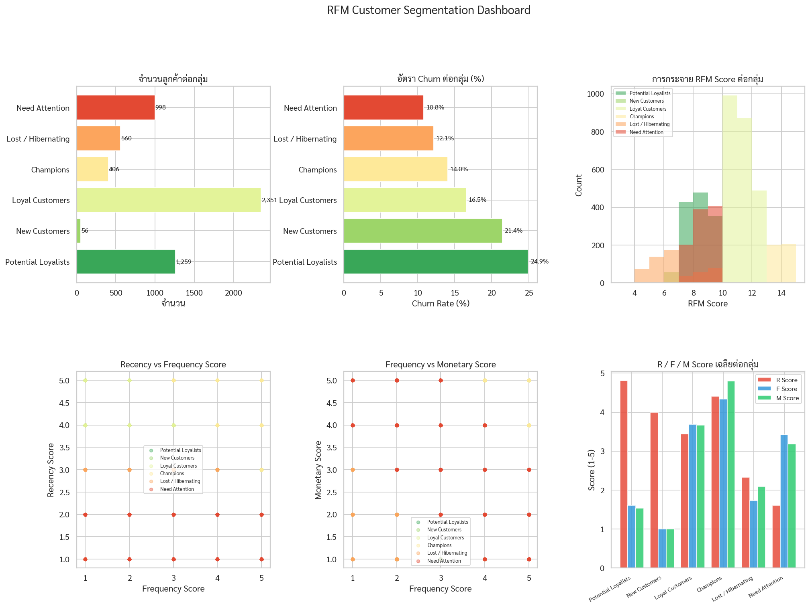

**สิ่งที่เห็นในกราฟ** (6 subplots):

1. **จำนวนลูกค้าต่อกลุ่ม**: Lost/Hibernating และ Need Attention มีจำนวนมาก
2. **Churn Rate ต่อกลุ่ม**: At Risk และ Lost/Hibernating มี Churn Rate สูงสุด
3. **RFM Score Distribution**: Champions มีคะแนนสูง (13–15), Lost/Hibernating ต่ำ
4. **R vs F Scatter**: Champions อยู่มุมบนขวา (Recency สูง + Frequency สูง)
5. **F vs M Scatter**: แสดงความสัมพันธ์ Frequency กับ Monetary ต่อกลุ่ม
6. **R/F/M Score เฉลี่ย**: Champions สูงทุกมิติ, Lost มีทุกมิติต่ำ

**กรอบ RFM ที่ใช้**:

| มิติ | คอลัมน์ | การ Score (1–5) |
|---|---|---|
| R (Recency) | DaySinceLastOrder | น้อย = ล่าสุด = Score สูง |
| F (Frequency) | OrderCount | มาก = Score สูง |
| M (Monetary) | CashbackAmount | มาก = Score สูง |

**กลุ่ม RFM และ Logic**:

| Score | Recency | Label |
|---|---|---|
| ≥ 13 | — | Champions |
| ≥ 10 | — | Loyal Customers |
| ≥ 7 | R ≥ 4 | Potential Loyalists |
| < 7 | R ≥ 4 | New Customers |
| ≥ 10 | R ≤ 2 | At Risk |
| ≥ 7 | R ≤ 2 | Need Attention |
| — | — | Lost / Hibernating |

---

## ส่วนที่ 9: K-Means Clustering

### กราฟที่ 13 — Elbow Method: หา k ที่เหมาะสม

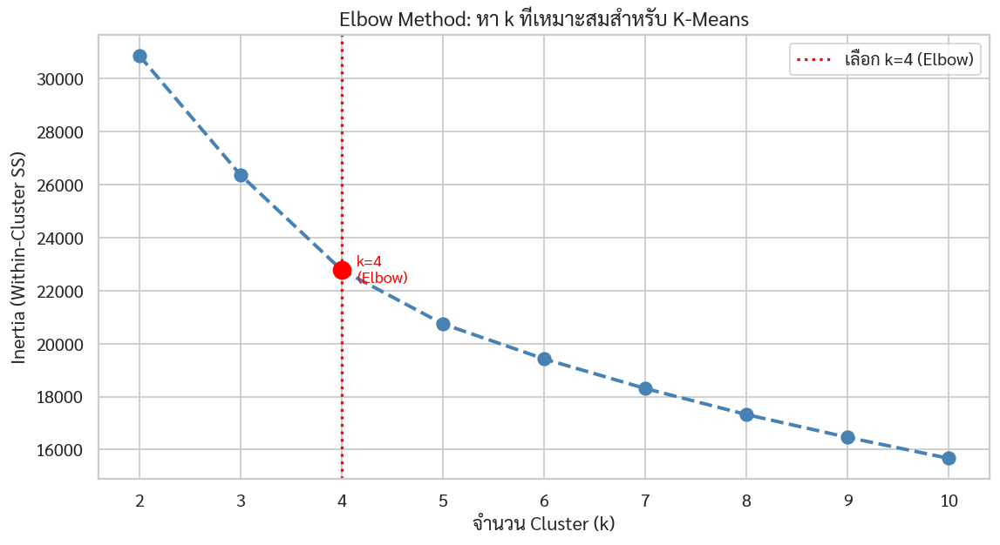

**สิ่งที่เห็นในกราฟ**: กราฟ Inertia (Within-Cluster Sum of Squares) สำหรับ k = 2 ถึง 10 เส้นสีแดงประแสดงจุด Elbow ที่ **k = 4**

**Feature ที่ใช้ Cluster (7 ตัว)**:
```
DaySinceLastOrder, OrderCount, CashbackAmount,
Tenure, CouponUsed, Complain, SatisfactionScore
```

### กราฟที่ 14 — K-Means Visualization ด้วย PCA และ t-SNE

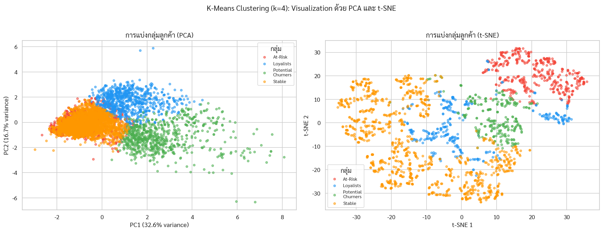

**สิ่งที่เห็นในกราฟ**:
- **PCA (ซ้าย)**: Projection 2 มิติ แสดงกลุ่มที่แยกออกจากกันได้ระดับหนึ่ง
- **t-SNE (ขวา)**: Non-linear Projection ที่แสดง Cluster ชัดเจนกว่า — เห็น Cluster ที่แยกตัวได้ดี

### กราฟที่ 15 — โปรไฟล์ Feature เฉลี่ยของแต่ละกลุ่ม

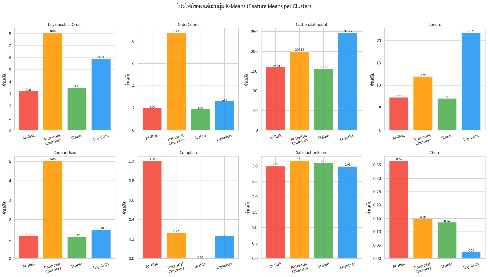

**สิ่งที่เห็นในกราฟ**: Bar Charts ของ Feature เฉลี่ย (Tenure, OrderCount, CashbackAmount ฯลฯ) แยกต่อ Cluster เพื่อตีความลักษณะของแต่ละกลุ่ม

**โปรไฟล์กลุ่มตาม Churn Rate จากสูงไปต่ำ**:

| กลุ่ม | Tenure (เดือน) | CashbackAmount | Churn Rate | ลักษณะ |
|---|---|---|---|---|
| At-Risk | สั้น | ต่ำ | สูงสุด | ลูกค้าใหม่ไม่ยั้ง |
| Potential Churners | ปานกลาง | ปานกลาง | สูง | กำลังเริ่มห่าง |
| Stable | ปานกลาง | ปานกลาง | ต่ำ | ลูกค้าทั่วไปที่มั่นคง |
| Loyalists | ยาว | สูง | ต่ำสุด | ลูกค้าประจำมูลค่าสูง |

### กราฟที่ 16 — ความชอบหมวดสินค้าของแต่ละกลุ่ม

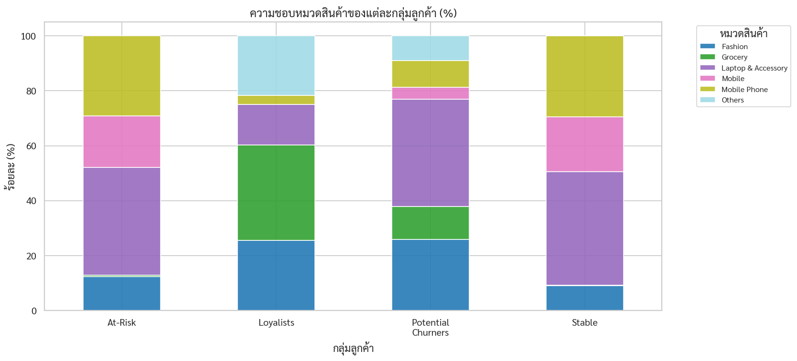

**สิ่งที่เห็นในกราฟ**: Stacked Bar Chart แสดงสัดส่วนหมวดสินค้าที่แต่ละ Cluster ชอบซื้อ

**Insight**: กลุ่ม At-Risk มีสัดส่วนซื้อ Mobile Phone สูง — ใช้ข้อมูลนี้ตั้ง Offer ส่วนลดหมวด Mobile เพื่อ Rescue

### กราฟที่ 17 — Tenure vs CashbackAmount: Loyalists vs At-Risk

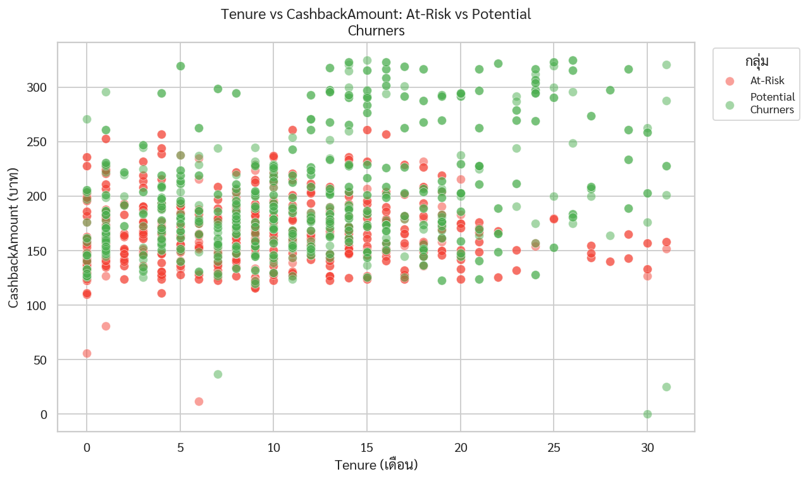

**สิ่งที่เห็นในกราฟ**: Scatter Plot เปรียบเทียบ 2 กลุ่มหลักบน Tenure × CashbackAmount — แสดงให้เห็น Separation ที่ชัดเจน

---

## สรุป Insight ที่ได้จาก EDA ทั้งหมด

| หัวข้อ | สิ่งที่ค้นพบ | Actionable |
|---|---|---|
| Class Imbalance | 83:17 → ต้องใช้ Stratified CV + class_weight | ตั้งค่าใน Model Training |
| Tenure | 0–3 เดือน → Churn ~60% | โปรแกรม Onboarding เร่งด่วน |
| Complain | ร้องเรียน → Churn 40.5% (3× กว่าปกติ) | Complaint Resolution Fast-Track |
| Tenure × Complain | Tenure สั้น + ร้องเรียน = เกือบ 100% Churn | กลุ่ม Priority สูงสุด |
| CashbackAmount | Median = 163 บาท ใช้แบ่ง High/Low Value | Threshold ใน Notebook 3 |
| RFM | 7 กลุ่ม จาก Champions → Lost/Hibernating | กลยุทธ์ต่างกันต่อกลุ่ม |
| K-Means k=4 | 4 กลุ่มแยกตาม Loyalty และ Churn Risk | ใช้เป็นพื้นฐาน Loyalty Program |
| Product Category | Mobile Phone users = Churn Risk สูง | ส่วนลดเฉพาะหมวดเพื่อ Rescue |

## Output ของ Notebook 1

- DataFrame ที่ clean แล้ว พร้อม Feature Engineering
- ภาพกราฟ EDA ทั้งหมดใน `outputs/figures/rfm_dashboard.png`
- ข้อมูลที่ผ่านการตรวจสอบและ Imputation พร้อมส่งต่อ Notebook 2
