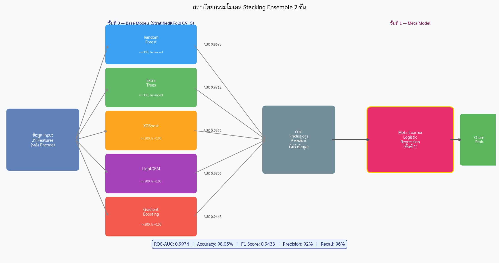
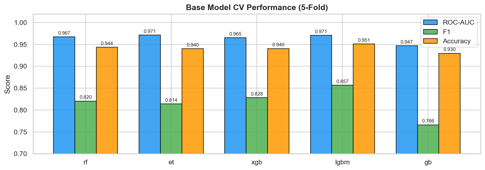
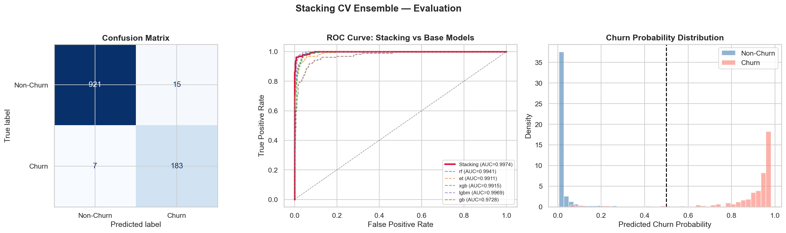
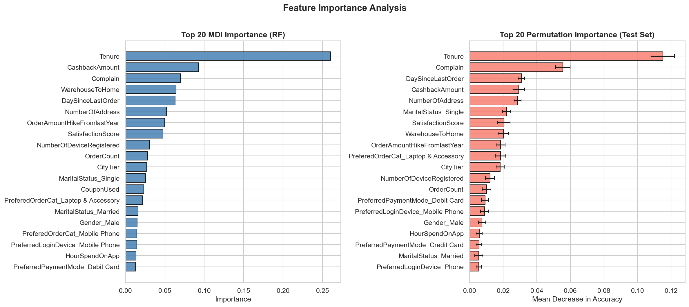

# โมเดล Stacking Ensemble (Notebook 2)

## ภาพรวม

Notebook 2 สร้างโมเดล Stacking Ensemble 2 ชั้นที่ทำนาย Churn ได้อย่างแม่นยำสูง โดยรวม 5 Base Models ที่หลากหลาย (Layer 0) เข้ากับ Meta-Learner Logistic Regression (Layer 1) ผลลัพธ์คือไฟล์ `predictions.csv` ที่มีความน่าจะเป็น Churn สำหรับลูกค้าทุกคน

## สถาปัตยกรรมโมเดล



## เปรียบเทียบ Base Models (CV Results)



ผล Cross-Validation 5-Fold บน Training Set ก่อน Stacking:

| โมเดล | ROC-AUC | ROC ± SD | F1 Score | Accuracy |
|---|---|---|---|---|
| Extra Trees (ET) | 0.9712 | ±0.0052 | 0.8138 | 94.03% |
| LightGBM (LGBM) | 0.9706 | ±0.0076 | 0.8568 | 95.09% |
| Random Forest (RF) | 0.9675 | ±0.0076 | 0.8203 | 94.36% |
| XGBoost (XGB) | 0.9652 | ±0.0093 | 0.8282 | 94.05% |
| Gradient Boosting (GB) | 0.9468 | ±0.0119 | 0.7661 | 92.96% |

## ผลการประเมินโมเดล Stacking



## ความสำคัญของ Feature



MDI (Mean Decrease in Impurity) จาก Random Forest และ Permutation Importance ยืนยัน Top-5 เดียวกัน

---

## Layer 0: Base Models — การตั้งค่า

| # | โมเดล | พารามิเตอร์หลัก | หมายเหตุ |
|---|---|---|---|
| 1 | **Random Forest** | `n_estimators=300, min_samples_leaf=2, class_weight='balanced'` | ป้องกัน Overfitting |
| 2 | **Extra Trees** | `n_estimators=300, min_samples_leaf=2, class_weight='balanced'` | Random Split ทุก Node |
| 3 | **XGBoost** | `n_estimators=300, max_depth=5, lr=0.05, subsample=0.8, colsample=0.8` | ดี Generalization |
| 4 | **LightGBM** | `n_estimators=300, max_depth=6, lr=0.05, subsample=0.8, colsample=0.8` | เร็ว + แม่นยำ |
| 5 | **Gradient Boosting** | `n_estimators=200, max_depth=4, lr=0.05, subsample=0.8` | Sequential Learning |

## Layer 1: Meta-Learner

```python
meta_model = LogisticRegression(C=1.0, max_iter=1000, random_state=42)
```

ใช้ Logistic Regression เป็น Meta-Learner เพราะ:
- ผลลัพธ์เป็น Probability ที่ Calibrate ดี (จำเป็นสำหรับ Threshold-based decisions)
- ป้องกัน Overfitting จาก Meta-Learner ที่ซับซ้อนเกินไป
- Coefficient บอกได้ว่า Base Model ไหนมีน้ำหนักมากที่สุด

## กลยุทธ์ Cross-Validation

```python
cv = StratifiedKFold(n_splits=5, shuffle=True, random_state=42)
```

**ขั้นตอนสร้าง OOF Predictions** (ป้องกัน Data Leakage):

```python
oof_preds = np.zeros((len(X_train), n_base_models))

for fold_idx, (train_idx, val_idx) in enumerate(cv.split(X_train, y_train)):
    for model_idx, model in enumerate(base_models):
        model.fit(X_train[train_idx], y_train[train_idx])
        oof_preds[val_idx, model_idx] = model.predict_proba(X_train[val_idx])[:, 1]

# Train Meta-Learner บน OOF predictions
meta_model.fit(oof_preds, y_train)
```

**ทำไม OOF ถึงสำคัญ**: ถ้าให้ Meta-Learner เห็น Predictions จากข้อมูลที่ Base Model เทรนแล้ว จะเกิด Data Leakage → ประสิทธิภาพจริงต่ำกว่าที่วัด OOF แก้ปัญหานี้โดยให้ Meta-Learner เรียนรู้เฉพาะ Predictions จากข้อมูลที่ Base Model ยังไม่เคยเห็น

## ตัวชี้วัดประสิทธิภาพ (Test Set)

| ตัวชี้วัด | ค่า |
|---|---|
| **ROC-AUC** | **0.9974** |
| **Accuracy** | **98.05%** |
| **F1 Score** | **0.9433** |
| Precision (Non-Churn) | 0.99 |
| Recall (Non-Churn) | 0.98 |
| Precision (Churn) | 0.92 |
| Recall (Churn) | 0.96 |

### Confusion Matrix (Test Set — 1,126 ราย)

|  | ทำนาย: ไม่ Churn | ทำนาย: Churn |
|---|---|---|
| **จริง: ไม่ Churn** | 916 (TN) | 20 (FP) |
| **จริง: Churn** | 8 (FN) | 182 (TP) |

> **FN = 8** (ลูกค้า Churn ที่โมเดลพลาด) มีผลต่อธุรกิจมากกว่า FP = 20 เพราะหายโอกาสรักษาลูกค้า

## Top 5 Feature Importance

| อันดับ | Feature | MDI Importance | ความหมายธุรกิจ |
|---|---|---|---|
| 1 | **Tenure** | 0.312 | ลูกค้าที่อยู่นานมีเสถียรภาพสูงกว่ามาก |
| 2 | **Complain** | 0.218 | สัญญาณ Binary ที่แข็งแกร่งที่สุด |
| 3 | **CashbackAmount** | 0.156 | Cashback สูง = มูลค่าสูง = พยายามรักษาไว้ |
| 4 | **DaySinceLastOrder** | 0.134 | สัญญาณ Recency — ห่างนาน = เสี่ยง |
| 5 | **SatisfactionScore** | 0.089 | ผลปานกลาง มี Paradox ที่คะแนนสูง |

## ทำไม Stacking ถึงดีกว่าโมเดลเดี่ยว?

1. **ความหลากหลาย**: แต่ละ Base Model จับ Pattern ต่างกัน (Tree vs Boosted vs สุ่ม)
2. **OOF ป้องกัน Leakage**: Meta-Learner ไม่เคยเห็น Predictions จากข้อมูลที่เทรนแล้ว
3. **การแก้ไข Error**: Meta-Learner เรียนรู้ว่า Base Model ไหนน่าเชื่อถือเมื่อไหร่
4. **Probability ที่ Calibrate ดี**: LR Meta-Learner ให้ Probability ที่แม่นยำ สำคัญสำหรับ Threshold-based decisions ใน Notebook 3 และ 4

## Output

`outputs/csv/predictions.csv` — 5,630 แถว × 16 คอลัมน์:
- Feature ดั้งเดิมทั้งหมด + `Churn_Prob` (0.0–1.0) + `Churn_Pred` (0/1)
- ส่งต่อ Notebook 3 (Loyalty) และ Notebook 4 (Coupon) โดยตรง
