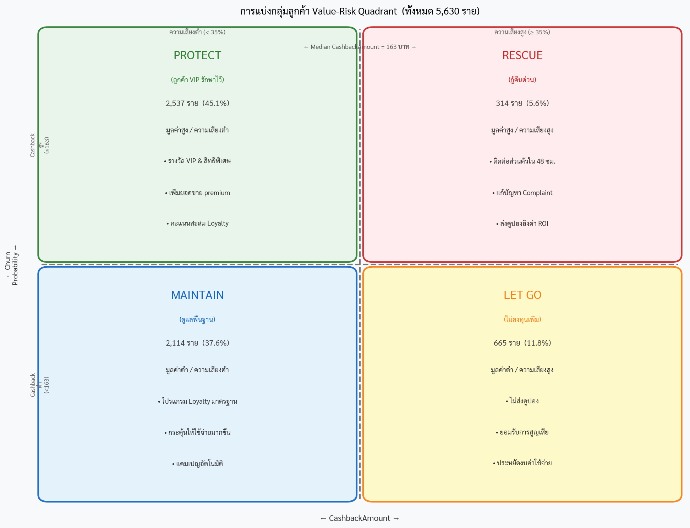
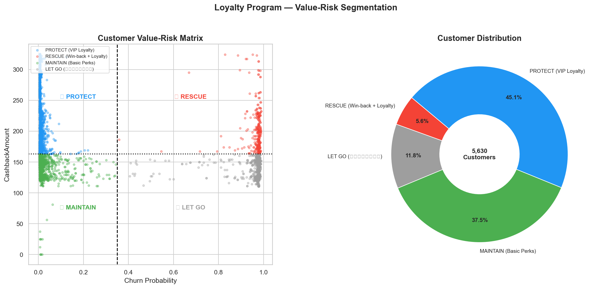

# โปรแกรมสมาชิกและการแบ่งกลุ่ม Value-Risk (Notebook 3)

## ภาพรวม

Notebook 3 นำไฟล์ `predictions.csv` จาก Notebook 2 มาใช้กรอบ 2 มิติ เพื่อจัดกลุ่มลูกค้า 5,630 รายออกเป็น 4 กลุ่มเชิงกลยุทธ์ ช่วยให้ธุรกิจจัดสรรทรัพยากรการรักษาลูกค้าได้อย่างมีประสิทธิภาพตามทั้งมูลค่าและความเสี่ยง

## ตาราง Value-Risk Quadrant (รายละเอียด)



## Scatter Plot Value-Risk



แต่ละจุดคือลูกค้า 1 ราย จุดสีแดง = Churn จริง, จุดสีน้ำเงิน = ไม่ Churn แสดงตำแหน่งตาม CashbackAmount และ Churn_Prob

---

## กรอบการแบ่งกลุ่ม

### Threshold ที่ใช้

| พารามิเตอร์ | ค่า | เหตุผล |
|---|---|---|
| `VALUE_MEDIAN` (CashbackAmount) | **163 บาท** | Median split — สูงกว่า = มูลค่าสูง |
| `CHURN_THRESHOLD` (Churn_Prob) | **0.35** | กำหนดโดยธุรกิจ — เกิน 35% = ความเสี่ยงสูง |

```python
VALUE_MEDIAN = df['CashbackAmount'].median()   # = 163 บาท
CHURN_THRESHOLD = 0.35

df['Value_Segment'] = np.where(df['CashbackAmount'] >= VALUE_MEDIAN, 'High', 'Low')
df['Risk_Segment'] = np.where(df['Churn_Prob'] >= CHURN_THRESHOLD, 'High', 'Low')
df['Quadrant'] = df['Value_Segment'] + '_' + df['Risk_Segment']
```

### ผลการแบ่งกลุ่ม (ยืนยันจากข้อมูลจริง)

| Quadrant | Label | จำนวน | % | เงื่อนไข |
|---|---|---|---|---|
| High Value + Low Risk | **PROTECT** | 2,537 | 45.1% | Cashback ≥ 163 + Churn < 35% |
| High Value + High Risk | **RESCUE** | 314 | 5.6% | Cashback ≥ 163 + Churn ≥ 35% |
| Low Value + Low Risk | **MAINTAIN** | 2,114 | 37.6% | Cashback < 163 + Churn < 35% |
| Low Value + High Risk | **LET GO** | 665 | 11.8% | Cashback < 163 + Churn ≥ 35% |

**รวม**: 2,537 + 314 + 2,114 + 665 = **5,630** ✓

---

## โปรไฟล์กลุ่ม RESCUE

314 ราย คือเป้าหมายหลักสำหรับการรักษาอย่างเร่งด่วน:

| ตัวชี้วัด | กลุ่ม RESCUE | ค่าเฉลี่ยทั้งหมด |
|---|---|---|
| Avg Churn Probability | **96.4%** | 17.9% |
| Avg CashbackAmount | **202.3 บาท** | 163 บาท |
| Avg Tenure | **5.58 เดือน** | ~10 เดือน |
| % ที่ร้องเรียน | **~90%** | ~17% |
| % ที่ Churn จริง | **99.4%** | 16.84% |
| Avg SatisfactionScore | **~2.5/5** | ~3/5 |

**สิ่งที่ค้นพบ**: ลูกค้ากลุ่ม RESCUE มักเป็นลูกค้าใหม่ (Tenure สั้น) ที่มีการร้องเรียน แต่ยังสร้างรายได้เหนือค่าเฉลี่ย พวกเขากำลังจะออกไปในช่วงต้นของ Lifecycle

---

## กลยุทธ์แต่ละกลุ่ม

### PROTECT (2,537 ราย — 45.1%)
**เป้าหมาย**: รักษา Loyalty ป้องกันไม่ให้เลื่อนไปเสี่ยงสูง

- อัปเกรด VIP Tier และสิทธิพิเศษสำหรับสมาชิก
- คะแนนสะสม Loyalty แบบทวีคูณในหมวดสินค้า Premium
- Early Access สินค้าใหม่และโปรโมชั่น
- Survey วัดความพึงพอใจเชิงรุก

> **ข้อควรระวัง**: อย่าสันนิษฐานว่าปลอดภัยตลอดไป — ติดตาม Churn Probability รายไตรมาส

### RESCUE (314 ราย — 5.6%)
**เป้าหมาย**: แทรกแซงการรักษาทันทีก่อนที่จะสายเกินไป

- ติดต่อส่วนตัวภายใน **48 ชั่วโมง**
- Fast-Track การแก้ Complaint (สำหรับคนที่ `Complain=1`)
- Offer ที่เฉพาะเจาะจง: คูปอง 20–30% + Cashback Bonus
- ส่งคูปองอิง ROI Score (→ Notebook 4)

**ตัวอย่าง Offer**:
- "เราคิดถึงคุณ" — Cashback 25% สำหรับคำสั่งซื้อถัดไป
- ส่งฟรีสำหรับ 3 คำสั่งซื้อถัดไป
- ส่วนลดส่วนตัวตาม `PreferedOrderCat`

### MAINTAIN (2,114 ราย — 37.6%)
**เป้าหมาย**: ค่อย ๆ เพิ่มมูลค่า ป้องกันไม่ให้ตกลงไป LET GO

- เข้าร่วมโปรแกรม Loyalty มาตรฐาน
- Nudge ให้เพิ่มความถี่การสั่งซื้อ
- แนะนำสินค้าเพื่อเพิ่ม Average Order Value
- แคมเปญ Email/App อัตโนมัติ

### LET GO (665 ราย — 11.8%)
**เป้าหมาย**: ลดการลงทุน ยอมรับการสูญเสียตามธรรมชาติ

- ไม่ส่งคูปองให้กลุ่มนี้
- ถอดออกจากแคมเปญการตลาดที่เข้มข้น
- ถ้ากลับมาใช้งานเอง → ต้อนรับกลับ
- ประหยัดได้: ตัดคูปองที่ไม่จำเป็น 665 ฉบับต่อรอบ

---

## การวิเคราะห์ Cost-Benefit

| สิ่งที่ทำ | ไม่มีการแบ่งกลุ่ม | มีการแบ่งกลุ่ม |
|---|---|---|
| คูปองที่แจก | 5,630 ฉบับ | 310–314 ฉบับ |
| สูญเปล่า (ไปคนไม่ Churn) | ~4,682 ฉบับ | ~0 ฉบับ |
| ประสิทธิภาพ | 16.84% ตรงเป้า | ~100% ตรงเป้า |
| ประหยัดได้ | Baseline | **~94.5%** |

## Output

`outputs/csv/rescue_priority_list.csv` — 314 แถว เรียงตาม `Churn_Prob` จากสูงไปต่ำ:
- Feature ดั้งเดิมทั้งหมด + `Churn_Prob` + Label Quadrant
- พร้อมส่งต่อ Notebook 4 เพื่อ Optimize การส่งคูปอง
- ใช้ได้โดยตรงสำหรับทีม Customer Success ติดต่อส่วนตัว
