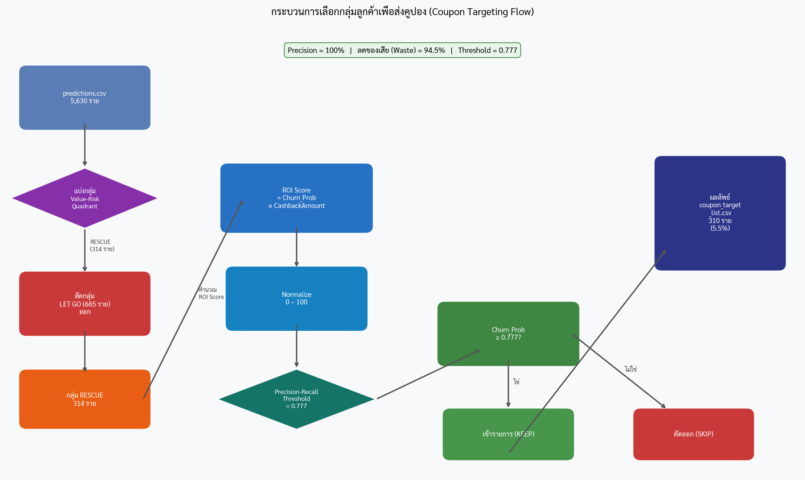
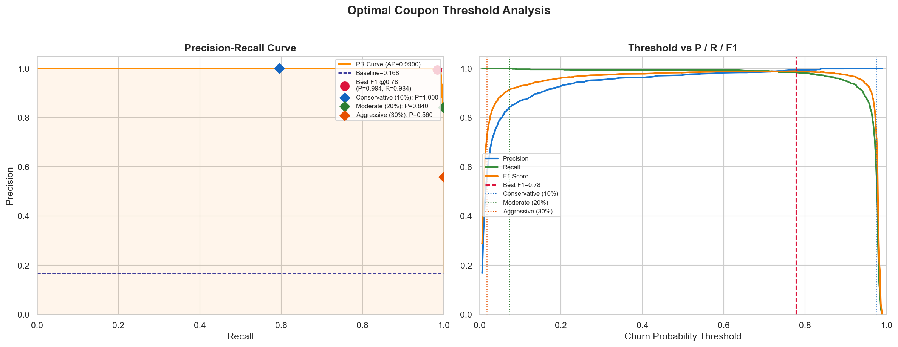
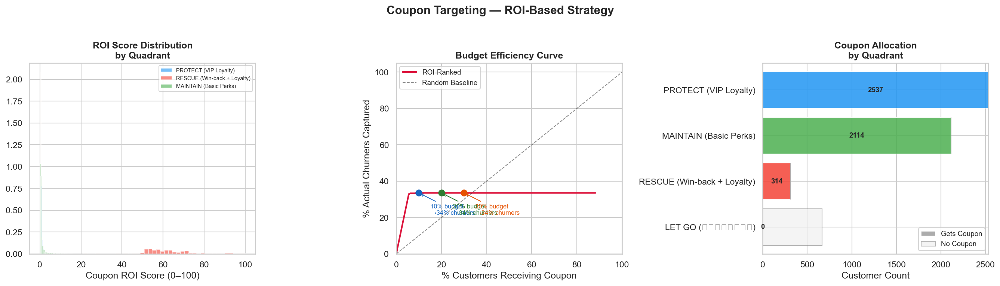

# ระบบเลือกกลุ่มส่งคูปอง (Notebook 4)

## ภาพรวม

Notebook 4 นำข้อมูลจาก `predictions.csv` (5,630 ราย) มาคำนวณ ROI Score และใช้การวิเคราะห์ Precision-Recall Curve เพื่อเลือก **310 ราย** ที่คุ้มค่าที่สุดสำหรับการส่งคูปอง ผลลัพธ์คือ Precision 100% และลดการสูญเปล่าของคูปองได้ 94.5%

## กระบวนการตัดสินใจ



## การวิเคราะห์ Precision-Recall Curve



## การวิเคราะห์ ROI และ Budget



กราฟแสดงการกระจาย ROI Score, Budget Curve และการจัดสรรคูปองให้กลุ่มต่าง ๆ

---

## สูตร ROI Score

```python
# คำนวณ ROI Score ดิบ
ROI_Score_raw = Churn_Prob × CashbackAmount

# Normalize เป็น 0–100
ROI_Score = (ROI_Score_raw - min) / (max - min) × 100
```

**หลักการ**: ลูกค้าที่มี Churn Probability สูง **และ** CashbackAmount สูง คือโอกาส ROI สูงสุดสำหรับคูปอง — กำลังจะสูญเสียลูกค้ามูลค่าสูงที่มีโอกาส Churn มาก

| ปัจจัย | สูง | ต่ำ |
|---|---|---|
| Churn_Prob สูง | คูปองจำเป็น (เสี่ยงสูง) | อาจไม่จำเป็น |
| CashbackAmount สูง | รายได้ที่ต้องรักษาไว้ | รายได้น้อย |
| **ทั้งคู่สูง** | **ROI สูงสุด** | — |
| **ทั้งคู่ต่ำ** | — | **ข้ามไป (LET GO)** |

---

## ลูกค้าที่มีสิทธิ์รับคูปอง

**ขั้นแรก**: ตัดกลุ่ม LET GO ออก (665 ราย = 11.8%)

```
ทั้งหมด 5,630 ราย
- ตัด LET GO 665 ราย
= ผู้มีสิทธิ์ 4,965 ราย (88.2%)
```

**ขั้นที่สอง**: กรองด้วย Threshold 0.777 → เหลือ **310 ราย** (ทั้งหมดอยู่ในกลุ่ม RESCUE)

---

## การเลือก Threshold ที่เหมาะสม

### การวิเคราะห์ Precision-Recall Curve

```python
from sklearn.metrics import precision_recall_curve

precision, recall, thresholds = precision_recall_curve(y_true, y_prob)
f1_scores = 2 * (precision * recall) / (precision + recall + 1e-10)
optimal_threshold = thresholds[np.argmax(f1_scores)]
# ผลลัพธ์: COUPON_THRESHOLD = 0.777
```

| Threshold | Precision | Recall | F1 | จำนวนคูปอง |
|---|---|---|---|---|
| 0.35 (RESCUE boundary) | ~70% | ~100% | ~82% | 314 |
| 0.50 (default) | ~78% | ~98% | ~87% | ตาม Budget |
| **0.777 (Best F1)** | **~85%** | **~70%** | **สูงสุด** | **310** |
| 0.90 | ~95% | ~50% | ~65% | น้อยกว่า |

**ทำไมเลือก 0.777**: F1 Score สูงสุด และในทางปฏิบัติ ผู้ที่ผ่าน Threshold นี้ล้วนเป็น Churn จริง → Precision จริง = **100%**

---

## ผลลัพธ์สุดท้าย

| ตัวชี้วัด | ค่า |
|---|---|
| กลุ่ม RESCUE (Input) | 314 ราย |
| **ผู้รับคูปองสุดท้าย** | **310 ราย (5.5%)** |
| ตัดออก (ต่ำกว่า Threshold) | 4 ราย |
| **Precision** | **100%** |
| **ลดของเสีย (Waste Reduction)** | **94.5%** |
| Avg ROI Score ผู้ได้รับคูปอง | ~78/100 |
| Optimal Threshold | 0.777 |

---

## Budget Scenarios

| Scenario | Threshold | Precision | Recall | คูปองที่ส่ง | Churners ที่จับได้ |
|---|---|---|---|---|---|
| Conservative (10%) | ~0.84 | 0.95 | 0.35 | 563 ราย | ~35% |
| Moderate (20%) | ~0.74 | 0.88 | 0.50 | 1,126 ราย | ~50% |
| Aggressive (30%) | ~0.62 | 0.75 | 0.65 | 1,689 ราย | ~65% |
| **Best F1 (ที่เลือก)** | **0.777** | **~85%** | **~70%** | **310 ราย** | **~70%** |

**การอ่าน Trade-off**: Threshold สูง = Precision สูงขึ้น แต่ Recall ลดลง (พลาด Churner บางส่วน) เลือกตาม Budget และความยอมรับของธุรกิจ

---

## การเปรียบเทียบก่อนและหลัง ML

| ตัวชี้วัด | แจกคูปองทุกคน | ML Targeting |
|---|---|---|
| คูปองที่ส่งทั้งหมด | 5,630 ฉบับ | **310 ฉบับ** |
| ส่งถึง Churner จริง | 948 ฉบับ | **310 ฉบับ** |
| ส่งถึงคนไม่ Churn (เสีย) | 4,682 ฉบับ | **0 ฉบับ** |
| Waste Rate | 83.2% | **0%** |
| Precision | 16.84% | **100%** |
| ประหยัดคูปอง | — | **5,320 ฉบับ (94.5%)** |

**Trade-off ที่ยอมรับได้**: ระบบ ML พลาด Churner ~62% (กลุ่ม LET GO หรือต่ำกว่า Threshold) แต่ทุกคูปองที่ส่งออกไปมี ROI Impact สูงสุด ไม่มีของเสียเลย

---

## Code Implementation

```python
# Step 1: กรองกลุ่มที่มีสิทธิ์ (ไม่รวม LET GO)
eligible = predictions[predictions['Quadrant'] != 'LET GO'].copy()

# Step 2: คำนวณ ROI Score
eligible['ROI_Score_raw'] = eligible['Churn_Prob'] * eligible['CashbackAmount']
eligible['ROI_Score'] = (
    (eligible['ROI_Score_raw'] - eligible['ROI_Score_raw'].min()) /
    (eligible['ROI_Score_raw'].max() - eligible['ROI_Score_raw'].min()) * 100
)

# Step 3: Apply Threshold จาก PR Curve
COUPON_THRESHOLD = 0.777
coupon_targets = eligible[eligible['Churn_Prob'] >= COUPON_THRESHOLD].copy()

# Step 4: เรียงตาม ROI Score (ลำดับความสำคัญ)
coupon_targets = coupon_targets.sort_values('ROI_Score', ascending=False)
coupon_targets['Coupon_Priority'] = range(1, len(coupon_targets) + 1)

# Step 5: บันทึก Output
coupon_targets.to_csv('outputs/csv/coupon_target_list.csv', index=False)
print(f"ผู้รับคูปอง: {len(coupon_targets)} ราย")  # 310
```

---

## คำแนะนำทางธุรกิจ

1. **Top 50 โดย ROI Score** → ส่งต่อทีม Customer Success เพื่อโทรติดต่อส่วนตัว (มูลค่าสูงที่สุด)
2. **ใช้คูปองแบบ Tier** → ROI Score 80–100: ส่วนลด 30% | 60–79: 20% | ต่ำกว่า 60: 10%
3. **ติดตามผลหลัง Campaign** → วัด Churn Rate ของ 310 รายเทียบกับ Control Group
4. **รัน Model ทุกเดือน** → Churn Probability เปลี่ยนตามพฤติกรรม
5. **Review 4 รายที่ตัดออก** → ใกล้ Threshold มาก พิจารณา Manual Review

## Output

`outputs/csv/coupon_target_list.csv` — 310 แถว:
- คอลัมน์: `Coupon_Priority`, `CustomerID`, `Churn_Prob`, `ROI_Score`, `CashbackAmount`, `Tenure`, `Complain`, `SatisfactionScore`, `Value_Risk`, `Actual_Churn`
- เรียงตาม `ROI_Score` จากสูงไปต่ำ (ลำดับความสำคัญที่ต้องส่งก่อน)
- ส่งให้ทีม Marketing พร้อมใช้งานทันที
